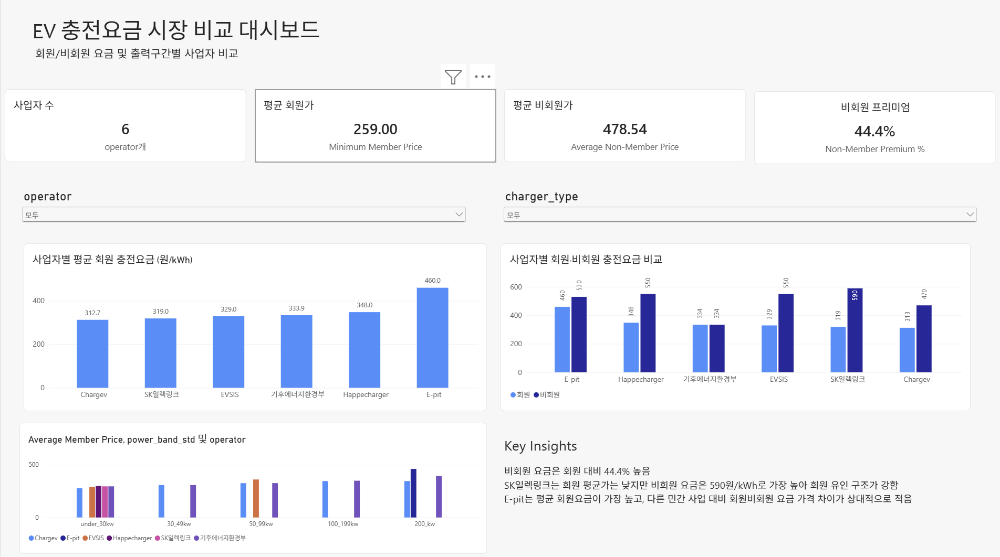

# EV Charging Pricing Analysis

## Project Overview

This project analyzes EV charging prices across major charging operators in South Korea.

The goal was to build an end-to-end data analytics workflow covering **web data collection, data cleaning, SQL/Python analysis, BI visualization, and cloud-based data management**.

Pricing data from six charging operators was collected and standardized to compare pricing differences by operator, charger type, power band, and customer type.

---

## Business Questions

* How do EV charging prices differ across operators?
* How large is the price premium for non-members?
* How do prices differ between slow and fast charging?
* Which charging power bands show meaningful price differences across operators?
* What pricing strategies can be identified across charging operators?

---

## Data Collection & Processing

Pricing data was collected from the official websites of six EV charging operators:

* E-pit
* Chargev
* Happecharger
* Ministry of Climate, Energy and Environment
* EVSIS
* SK Electlink

Depending on each website structure, `requests`, `BeautifulSoup`, and `Selenium` were used to collect static and JavaScript-rendered pricing data.

The collected data was cleaned and standardized using Pandas into a common analytical structure including:

* `operator`
* `charger_type`
* `power_band`
* `customer_type`
* `price_per_kwh`
* `plan_name`
* `effective_date`
* `crawl_date`
* `source_url`

The final dataset contains **54 pricing observations across six operators**.

---

## Analysis Workflow

```text
Official EV Charging Websites
        ↓
Python Web Crawling
        ↓
Pandas Data Cleaning
        ↓
PostgreSQL / SQL Analysis
        ↓
Python Analysis
        ↓
Power BI Dashboard
        ↓
Google Cloud Storage
        ↓
BigQuery
        ↓
Power BI–BigQuery Integration
```

---

## Key Insights

### 1. Membership plays an important role in pricing

Several private charging operators showed substantial price differences between member and non-member rates.

Examples of calculated non-member price premiums:

* SK Electlink: **84.95%**
* EVSIS: **67.17%**
* Happecharger: **58.05%**
* Chargev: **50.32%**
* E-pit: **15.22%**

This suggests that membership pricing can be used as a strong incentive to retain customers within an operator's charging ecosystem.

### 2. Fast charging carries a clear price premium

Average member charging prices were:

* Slow charging: **290.33 KRW/kWh**
* Fast charging: **357.81 KRW/kWh**

Fast charging therefore showed a meaningful price premium compared with slow charging.

### 3. Pricing differences vary by charging power band

Among directly comparable power bands, the `200_kw` category showed the largest price spread:

* Minimum: **345.0 KRW/kWh**
* Maximum: **393.1 KRW/kWh**
* Spread: **48.1 KRW/kWh**

Lower power bands showed relatively smaller differences between operators.

---

## Power BI Dashboard

An interactive Power BI dashboard was created to analyze:

* Average charging price
* Minimum and maximum price
* Operator-level pricing
* Member vs. non-member pricing
* Slow vs. fast charging
* Charging power-band differences

Interactive filters allow users to explore pricing structures across operators and charging conditions.



---

## Cloud Integration

Google Cloud Platform was used to extend the local analytics workflow into a cloud-based environment.

* **Google Cloud Storage** — storage of the cleaned dataset
* **BigQuery** — cloud-based data storage and SQL querying
* **Power BI + BigQuery** — direct connection between the cloud dataset and BI dashboard

This created a basic cloud analytics workflow from data storage to querying and visualization.

---

## Tech Stack

**Data Collection & Processing**

* Python
* Pandas
* Requests
* BeautifulSoup
* Selenium

**Database & Analysis**

* PostgreSQL
* SQL
* Google BigQuery

**Visualization**

* Power BI

**Cloud**

* Google Cloud Platform
* Google Cloud Storage
* BigQuery

---

## Repository Structure

```text
ev-charging-analysis/
│
├── README.md
│
├── data/
│   └── charging_fees_clean.csv
│
├── src/
│   ├── crawling/
│   └── analysis/
│
├── sql/
│   └── analysis_queries.sql
│
├── dashboard/
│   └── ev_charging_dashboard.pbix
│
└── images/
    └── dashboard.png
```

---

## Project Scope

This project demonstrates an end-to-end data analytics workflow:

**Web Crawling → Data Cleaning → SQL Analysis → Python Analysis → BI Visualization → Cloud Integration**

The project focused not only on technical implementation, but also on translating pricing data into business insights regarding membership incentives, charging-speed premiums, and operator pricing strategies.


